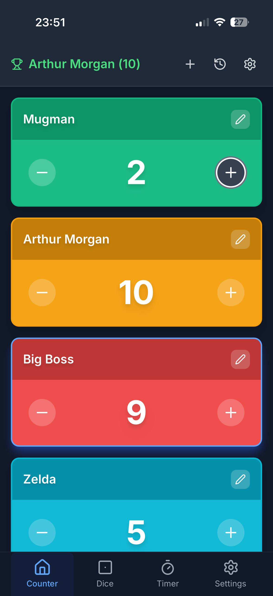

# Score Keeper - Лічильник Балів

**EN:** The best app for keeping score in any game! Track points, scores, and more — fast, simple, and ad-free.

**UA:** Кращий додаток для підрахунку очок у будь-якій грі! Відстежуйте очки, рахунки та багато іншого — швидко, просто й без реклами.

## Screens




## Features

- 🎯 **Counter Page**: Add players, track scores with beautiful cards
- 🎲 **Dice Roller**: Roll multiple dice with customizable sides (d4-d20)
- ⏱️ **Timer**: Full-featured timer with play, pause, stop, and add minute
- ⚙️ **Settings**: Theme (auto/light/dark), language, and customization options

## Tech Stack

- **Next.js 14** - React framework
- **TypeScript** - Type safety
- **TailwindCSS** - Utility-first CSS framework
- **Framer Motion** - Smooth animations
- **Zustand** - State management
- **i18next** - Internationalization

## Getting Started

### Prerequisites

- Node.js 18+
- npm or yarn

### Installation

```bash
# Install dependencies
npm install

# Run development server
npm run dev

# Build for production
npm run build

# Start production server
npm start
```

Open [http://localhost:3000](http://localhost:3000) to view the app.

## Languages Supported

### European Languages

- English
- Русский (Russian)
- Українська (Ukrainian)
- Беларуская (Belarusian)
- Català (Catalan)
- Español (Spanish)
- Deutsch (German)
- Français (French)
- Italiano (Italian)
- Português (Portuguese)
- Polski (Polish)
- Română (Romanian)
- Nederlands (Dutch)
- Ελληνικά (Greek)
- Čeština (Czech)
- Magyar (Hungarian)
- Svenska (Swedish)
- Suomi (Finnish)
- Dansk (Danish)
- Български (Bulgarian)
- Hrvatski (Croatian)
- Slovenčina (Slovak)
- Slovenščina (Slovenian)
- Lietuvių (Lithuanian)
- Latviešu (Latvian)
- Eesti (Estonian)
- Gaeilge (Irish)
- Malti (Maltese)

### Asian Languages

- 中文 (Chinese)
- 日本語 (Japanese)
- Tiếng Việt (Vietnamese)
- ไทย (Thai)
- සිංහල (Sinhala)

### Other Languages

- Türkçe (Turkish)
- Azərbaycan (Azerbaijani)
- Հայերեն (Armenian)
- ქართული (Georgian)

## Features in Detail

### Counter Page

- Add unlimited players with auto-generated names
- Customize player colors and step values
- Quick add points with preset values
- Custom point input
- View modes: Table or Grid
- Show highest/lowest scores
- Show total score

### Dice Page

- Roll 1, 2, or 4 dice
- Choose dice sides: d4, d6, d8, d10, d12, d20
- Animated roll results

### Timer Page

- Play/Pause/Stop controls
- Add minute button
- Beautiful time display

### Settings Page

- Theme selection (Auto/Light/Dark)
- Language selection
- Keep screen active (if supported)
- Vibration (if supported)
- Customize default point values

## Project Structure

```
├── app/
│   ├── layout.tsx          # Root layout with SEO
│   ├── page.tsx             # Main page with navigation
│   ├── globals.css          # Global styles
│   └── providers.tsx        # App providers
├── components/
│   ├── pages/               # Page components
│   ├── BottomNavigation.tsx # Bottom nav bar
│   ├── PlayerCard.tsx       # Player card component
│   ├── AddPlayerModal.tsx   # Add player modal
│   ├── EditPlayerModal.tsx  # Edit player modal
│   ├── AddPointsModal.tsx   # Add points modal
│   └── UISettingsModal.tsx  # UI settings modal
├── store/
│   └── useStore.ts          # Zustand store
├── lib/
│   └── i18n.ts              # i18n configuration
└── public/
    └── locales/             # Translation files
```

## License

MIT
